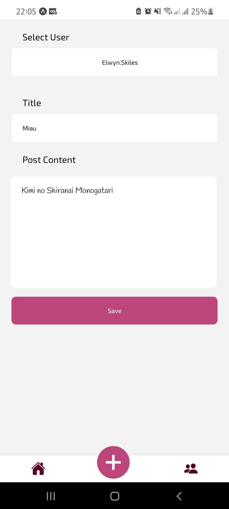
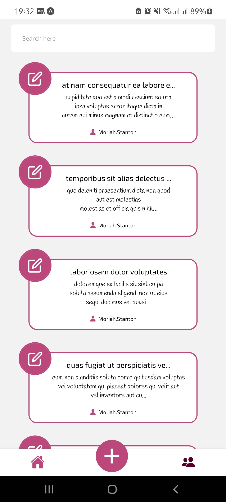
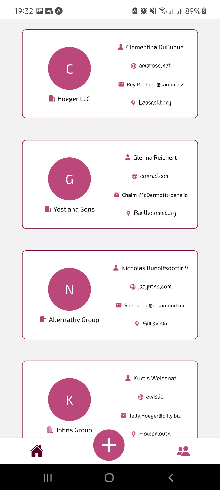

# Click Posts APP

  
  
  

This is an application for the ClickSoft internship program challenge

    

<h2>Funcionalitties</h2>
<ul>
  <li>Create, delete, update and search posts</li>
  <li>Post id manager</li>
  <li>Axios</li>
  <li>Redux RTK</li>
  <li>React Navigation</li>
  <li>Styled Components</li>
  <li>Vector Icons</li>
  <li>Visual Studio</li>
</ul>
<h2>Technologies</h2>
<ul>
  <li>Expo</li>
  <li>Typescript</li>
  <li>Axios</li>
  <li>Redux RTK</li>
  <li>Jsonplaceholder API</li>
  <li>React Navigation</li>
  <li>Styled Components</li>
  <li>Vector Icons</li>
  <li>Visual Studio</li>
</ul>
<h2>How to use</h2>
<ul>
  <li>Install Node and Expo-Cli</li>
  <li>Download zip or git clone and</li>
  <li>Use packet manager of your preference to install dependencies</li>
  <li>Run 'yarn start' on local project</li>
</ul>
